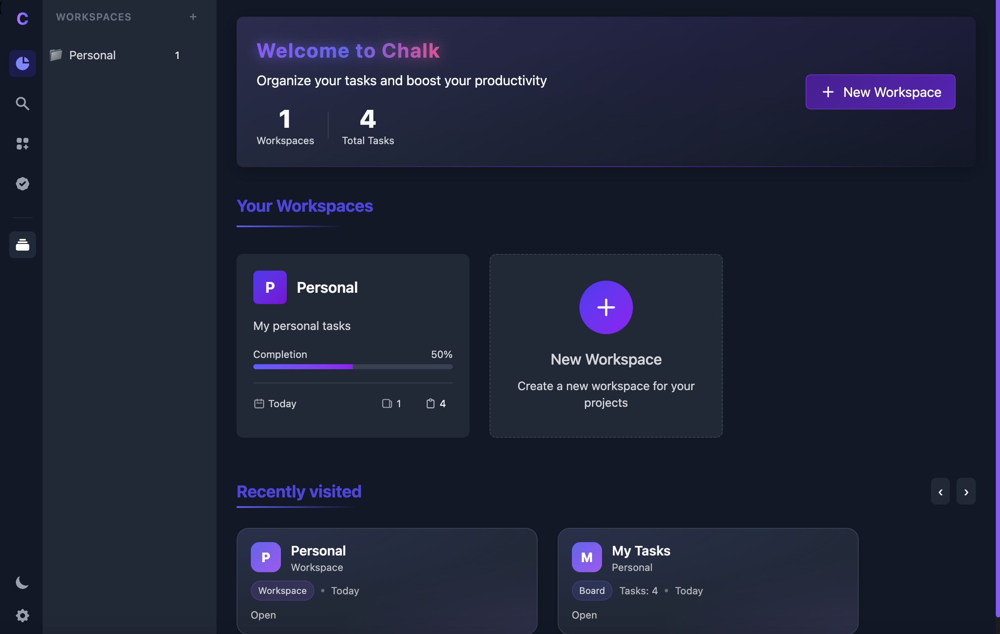
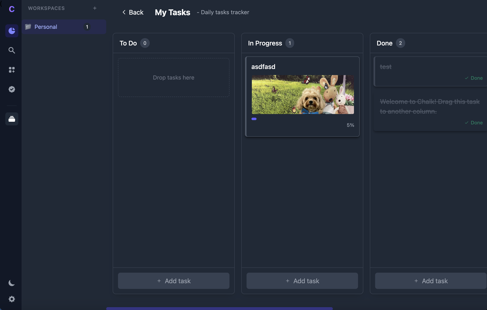
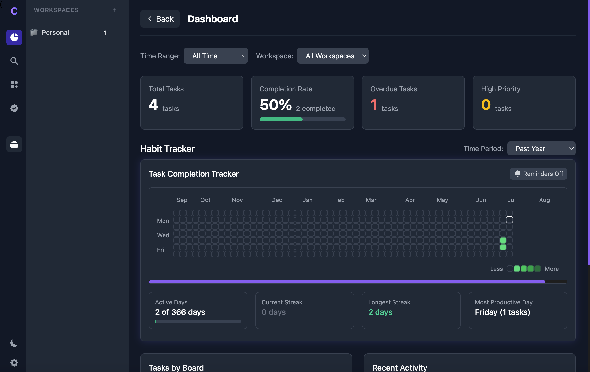
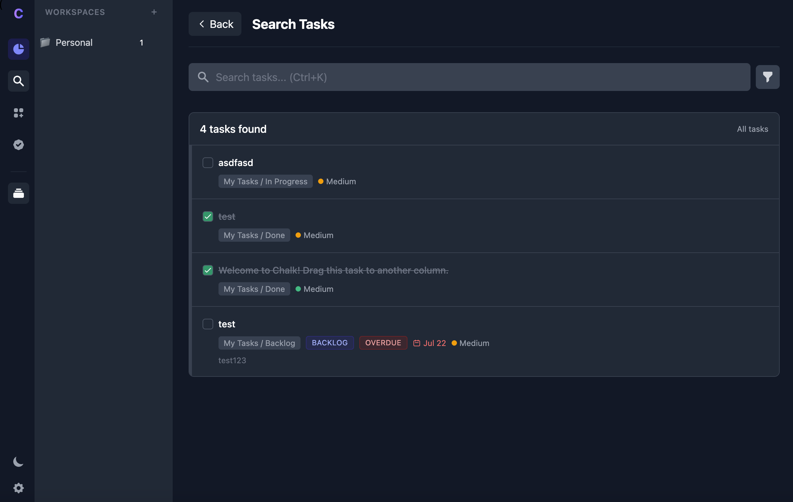

# Chalk — Local-First Kanban (Beta)

A fast, privacy first Kanban board that runs entirely on your computer. No cloud, no accounts, no AI. Just boards, cards, and flow.

  

## Download

### Zip Files

- **macOS (Apple Silicon, M1–M4)**: https://github.com/duriantaco/chalk/releases/latest/download/Chalk-mac-arm64.dmg  
- **macOS (Intel x64)**: https://github.com/duriantaco/chalk/releases/latest/download/Chalk-mac-x64.dmg

**Note**: run `xattr -dr com.apple.quarantine "/Applications/Chalk.app"` after installing

## Core views

| Kanban | Backlog |
| --- | --- |
|  |  |

  

## Features (current)

- Local-first, offline
- Boards & columns with drag-and-drop cards
- Global shortcut (Cmd/Ctrl + Shift + K)
- Checklists with a mini progress bar on each card

## Search & filters

- Export / import your data to JSON

## Roadmap (post-beta)
saved views, recurring tasks, WIP limits, attachments, analytics (CFD/cycle time), templates.

## Usage basics

1. Create a board -> add columns (e.g., "To-Do", "Doing", "Done")
2. Add cards -> Click "Add Task" in a column
3. Checklists -> open a card and add checklist items. The card shows a tiny progress bar
4. Drag & drop cards between columns to move them through your flow.
5. Search from the search view to filter by text/labels/dates.
6. Export/Import from "Settings" to back up or restore.

## Keyboard shortcuts

Quick Add: Cmd/Ctrl + Shift + K
Confirm in dialogs: Enter
Close modal/overlay: Esc

(More to come)

## Data & privacy

- Where data lives: stored locally in your browser’s IndexedDB (via Yjs)

- Backups: use Export to save a JSON to disk. You can import it later on any machine.

- No network: the app does not send your data anywhere.

**Tip:** If you want automatic off-device backup, point exports to a folder synced by your own service. We don’t ship any cloud integration.

## Troubleshooting

If macOS says “Chalk is damaged and can’t be opened” (unsigned beta):

1) Move **Chalk** to **Applications**.
2) Open Terminal and run:
   `xattr -dr com.apple.quarantine "/Applications/Chalk.app"`
3) Right-click **Chalk** -> **Open** -> **Open**.

## Contributing

PRs and issues welcome. Please keep features local-first and lightweight.

## License

Apache 2.0 © Oha